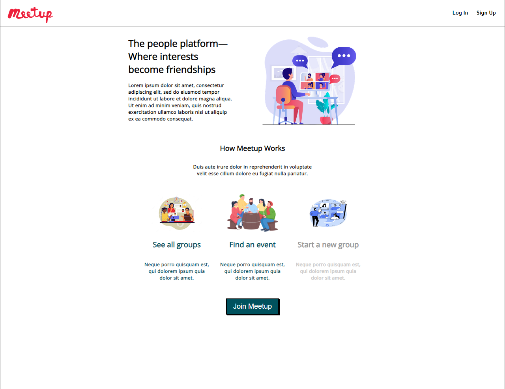
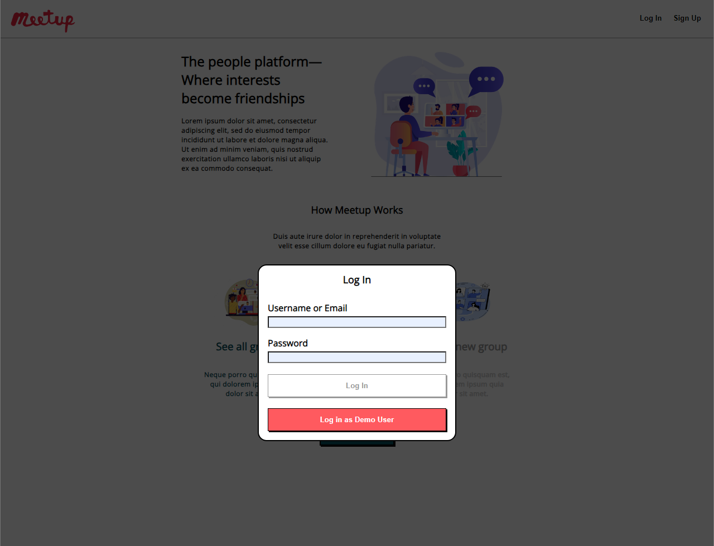

# Full-stack API

This project is a clone of the site Meetup, emulating the CRUD routes for databases of Users, Groups that they can create, and events that they can create for those Groups.

The API is constructed using:
- SQLite databases
- Express backend framework
- React frontend framework
- Redux library

To view the API, please visit https://api-project-mspi.onrender.com.

You can view the site either as a visitor, or log in using the "Log In" Navbar Navlink.

As the Demo User, you are host to "Group One" and its associated Events. You can currently explore the CREATE, READ, UPDATE, and DELETE routes for the Groups feature and the CREATE, READ, and DELETE routes for the Events feature.
